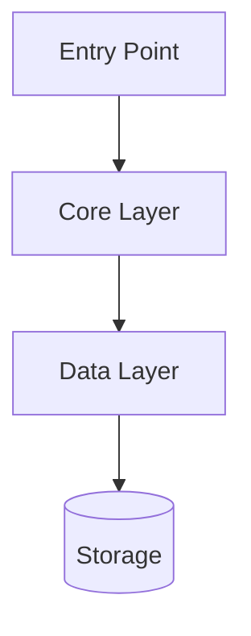
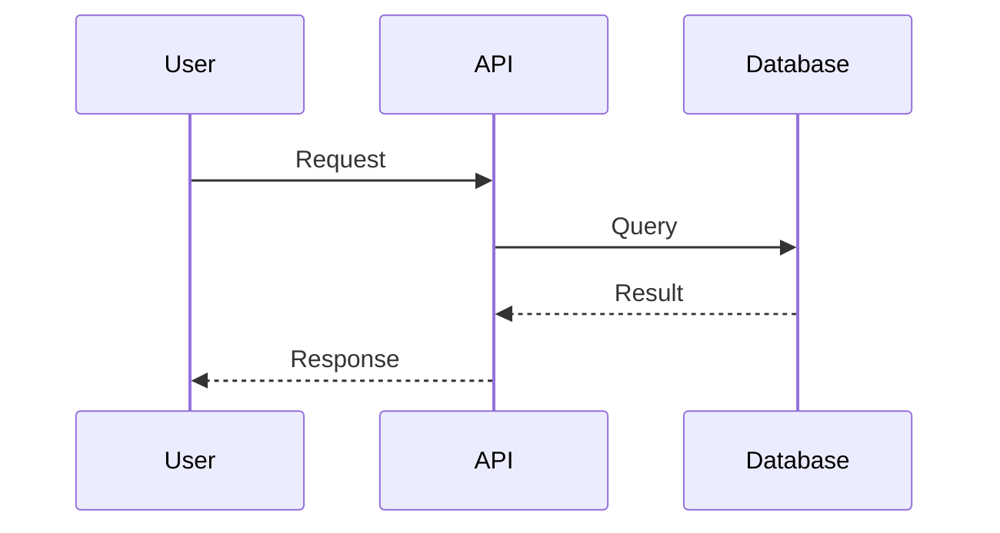

# CODEMAPS.md

Architecture documentation for your project. Update this as architecture evolves.

## How to Use This File

1. Replace section headers with your actual components
2. Keep diagrams up-to-date as code changes
3. Reference this file instead of reading many source files
4. Update after each major architectural change

## High-Level Architecture

Replace this diagram with your actual architecture.

## Key Components

### Component: [Name]
- **Location**: `src/[path]/`
- **Purpose**: [What it does]
- **Key files**: [List main files]
- **Dependencies**: [What it uses]

Add a section for each major component in your codebase.

## Data Flow

Describe how data moves through your system. Add sequence diagrams for complex flows:

## Key Patterns

Document patterns used across the codebase so agents follow them consistently:

- **Pattern Name**: Where used, how it works
- **Another Pattern**: Description

## External Dependencies

| Dependency | Purpose | Docs |
|------------|---------|------|
| [name] | [why used] | [link] |

## Testing

- **Unit**: `tests/unit/` - Test individual functions
- **Integration**: `tests/integration/` - Test component interactions
- **E2E**: `tests/e2e/` - Test full workflows

---

*Update this file when architecture changes.*
